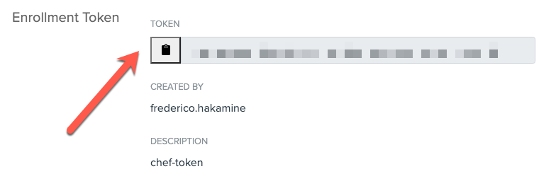
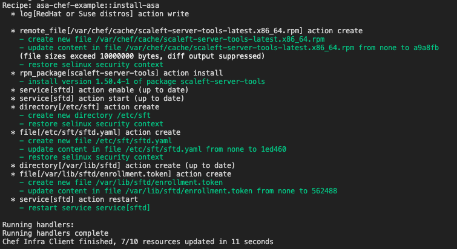
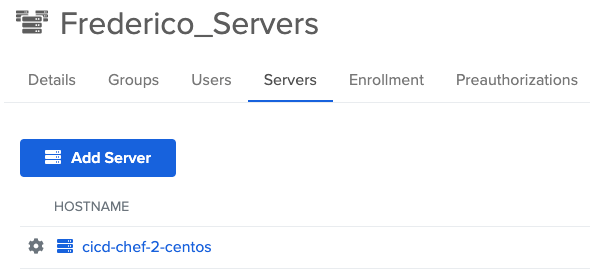
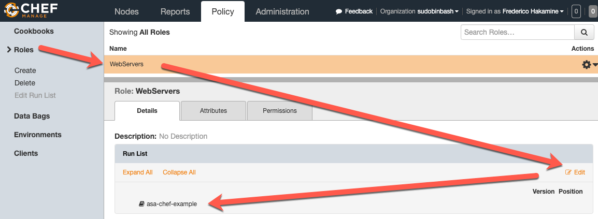
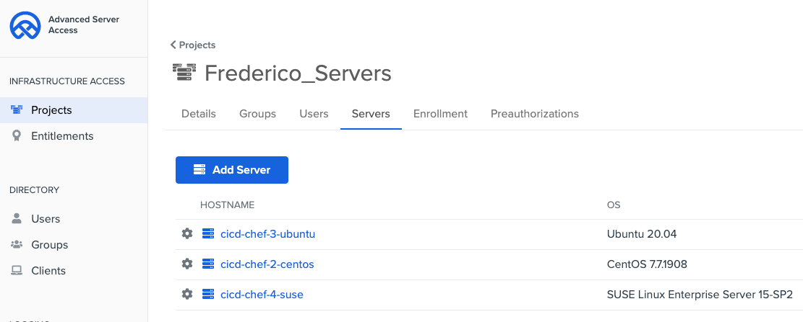
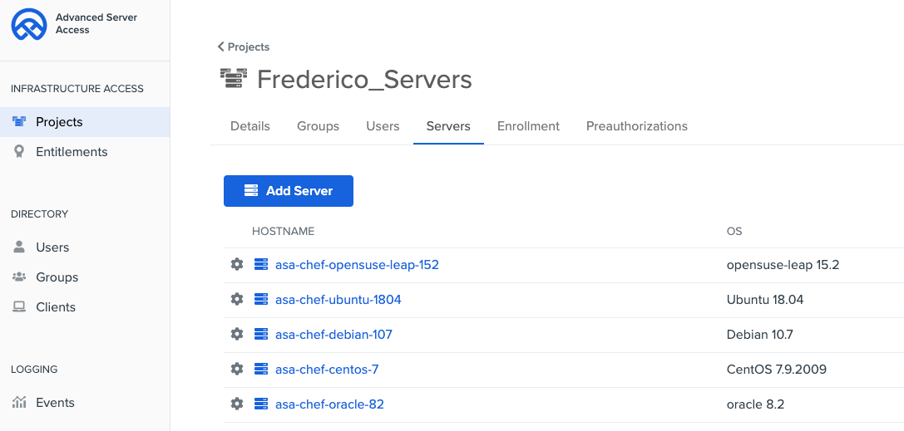

# asa-ansible-example

This is a sample Chef cookbook for enrolling and securing access to servers with Okta Advanced Server Access (ASA).

To leverage this example, you must have access to your Chef workstation/servers (or [Test Kitchen](https://kitchen.ci/)) and Okta ASA as administrator.

**NOTE:** If you don’t have an Okta ASA account yet, you can go and [create one here](https://app.scaleft.com/p/signup).

# Setup

**Step 1:** Clone this repository under your Chef repo home directory

```shell
cd $CHEFREPO/cookbooks
git clone https://github.com/sudobinbash/asa-chef-example.git
```

**Step 2:** Get an enrollment token in ASA:

1. Access Okta ASA as Administrator.
2. Click **Projects** and then select or create a new project.
3. Click **Enrollment** > **Create Enrollment Token**.
4. Enter a name (i.e. `chef-token`) and click **Submit**.
5. Copy the enrollment token



**Step 3:** Edit the `asa-chef-example/attributes/default.rb` file, replacing `ENROLLMENT_TOKEN` with the token from ASA:
```ruby
default['asa_enrollment_token'] = 'ENROLLMENT_TOKEN'
```

**Step 4:** Confirm your configuration has no typos: `cookstyle attributes/default.rb`:
```shell
# cookstyle attributes/default.rb
Inspecting 1 file
1 file inspected, no offenses detected
```


# Using the Sample

You can use this sample in:
1. [Chef Infrastructure (using Chef Server and Nodes)](#option-1-chef-infrastructure-chef-server-and-nodes)
2. [VMs hosted in your machine (using Chef's Test Kitchen)](#option-2-vms-hosted-in-your-machine-chefs-test-kitchen)
3. [A Linux machine with Chef Workstation (using Chef Zero)](#option-3-in-your-linux-machine-with-chef-workstation)

## Option 1: Chef Infrastructure (Chef Server and Nodes)

**Step 1:** Upload your sample cookbook to the chef server `knife upload asa-chef-example`

**Step 2:** Test the recipe on one of your servers: `knife ssh <NODE_CONNECTION_DETAILS> 'sudo chef-client "recipe[asa-chef-example]"`

Replace `<NODE_CONNECTION_DETAILS>` with the node attributes following [Chef's doc](https://docs.chef.io/workstation/knife_ssh/). Examples:
- Server with SSH user/key: `knife ssh --ssh-user centos --ssh-identity-file key.pem 'name:cicd-chef-2-centos' 'sudo chef-client "recipe[asa-chef-example]"`
- Server with SSH user/password: `knife ssh --ssh-user centos --ssh-password Pa$$word1 'name:cicd-chef-2-centos' 'sudo chef-client "recipe[asa-chef-example]"`

**Note:** Alternatively, log into a chef node and run `sudo chef-client "recipe[asa-chef-example]"`

Chef will confirm that the recipe was successfuly executed in your server:



In ASA, you will see your server enrolled in your project:



**Step 3 (Optional):** Add the `asa-chef-example` recipe to roles and other nodes in chef using the `knife` command or from chef manage:



After the recipe is enforced on other nodes, the nodes are available on ASA for access:



## Option 2: VMs hosted in your machine (Chef's Test Kitchen)

[Chef's Test Kitchen](https://kitchen.ci/) provides a test harness environment to try infrastructure as code implementations – like this sample – in isolation.

Our sample includes a test script `kitchen.yml` that "runs our test kitchen" on VirtualBox VMs managed thru Vagrant.

To use the test kitchen:

**Step 1:** [Install chef workstation](https://downloads.chef.io/products/workstation)

**Step 2:** Install VirtualBox and Hashicorp Vagrant. (If you have a mac and homebrew, you can run the commands):
```shell
brew install virtualbox --cask
brew install vagrant --cask
```

**Step 3:** Get your computer network interface name that will be used for in the test VMs: `VBoxManage list bridgedifs | grep Name`:

```shell
# VBoxManage list bridgedifs | grep Name
Name:            en0: Wi-Fi (AirPort)
Name:            bridge0
VBoxNetworkName: HostInterfaceNetworking-bridge0
Name:            llw0
VBoxNetworkName: HostInterfaceNetworking-llw0
Name:            en12: USB 10/100/1000 LAN
VBoxNetworkName: HostInterfaceNetworking-en12
```

**Tip:** Each test VM will have an IP in your network. To simplify the test, we recommend you use the same network where you get internet from (example `en0: Wi-Fi (AirPort)`).

**Step 4:** Edit and save the `kitchen.yml` file.

- In lines 25-29, define the list of servers/VMs you want to test. You can remove a specific servers or distro by adding a comment (`#`+ space). Example: `# - name: centos-7`.
- In line 35, paste the network interface name that will be used to bridge network connections. For example: `- ["public_network", { bridge: "en0: Wi-Fi (AirPort)" }]`

**Step 5:** To setup your kitchen (download and launch VMs), enter: `kitchen create`

**Step 6:** To confirm your kitchen is running, enter: `kitchen list`. The list will show you the VMs with last action Created:
```shell
# kitchen list
Instance                    Driver   Provisioner  Verifier  Transport  Last Action  Last Error
asa-chef-ubuntu-1804        Vagrant  ChefZero     Inspec    Ssh        Created      <None>
asa-chef-centos-7           Vagrant  ChefZero     Inspec    Ssh        Created      <None>
asa-chef-debian-107         Vagrant  ChefZero     Inspec    Ssh        Created      <None>
asa-chef-opensuse-leap-152  Vagrant  ChefZero     Inspec    Ssh        Created      <None>
asa-chef-oracle-82          Vagrant  ChefZero     Inspec    Ssh        Created      <None>
```

**Step 7:** To install and enroll your servers on ASA, enter `kitchen converge`. 

Kitchen will execute the cookbook and enroll all your servers in ASA.

In ASA, you will see your server enrolled in your project:




**Step 8:** To confirm the recipe worked, enter `kitchen verify`:

The test kitchen will validate if ASA is properly installed, enabled, and running on all servers. For example:

```shell
-----> Verifying <asa-chef-oracle-82>...
       Loaded tests from {:path=>".Users.fhakamine.sudobinbash.asa-chef-example.test.integration.default"} 

Profile: tests from {:path=>"/Users/fhakamine/sudobinbash/asa-chef-example/test/integration/default"} (tests from {:path=>".Users.fhakamine.sudobinbash.asa-chef-example.test.integration.default"})
Version: (not specified)
Target:  ssh://vagrant@127.0.0.1:2203

  Service sftd
     ✔  is expected to be installed
     ✔  is expected to be enabled
     ✔  is expected to be running

Test Summary: 3 successful, 0 failures, 0 skipped
       Finished verifying <asa-chef-oracle-82> (0m1.09s).
```

**Step 9:** After tests, you can blow away your kitchen with the command `kitchen destroy`, and then remove the servers from the ASA Admin console.

## Option 3: In your Linux machine with Chef Workstation

**Step 1:** Test the chef cookbook `chef-client --local-mode --why-run recipes/default.rb`

**Step 2:** Apply the recipe: `chef-client --local-mode recipes/default.rb`

Chef will return Confirm that chef configured your server with success. 

In ASA, you will see your server enrolled in your project.


## Power Tips / FAQ

**Wait... how does this sample cookbook work?**

This cookbook has 4 major files:

1. `recipes/install-asa.rb`: This recipe runs by default on the cookbook. It installs the ASA server agent and then enroll your servers into ASA for remote access. 
2. `recipes/uninstall-asa.rb`: This recipe uninstalls the ASA server agent from your machine.
3. `kitchen.yml`: This file provides specs for testing this sample cookbook in Chef's Kitchen (with VirtualBox and Vagrant)
4. `test/integration/default/default_test.rb`: This file provides specs for validating the sample cookbook

The cookbook supports multiple Linux distros using the server distro family to identify the ideal setup (and uninstall) tasks:

```ruby
case node['platform_family']
when 'rhel', 'suse', 'linux'
  # CONTENT
  log 'RedHat, Suse, or RPM-based distros'
  remote_file "#{Chef::Config['file_cache_path']}/scaleft-server-tools-latest.x86_64.rpm" do
    source 'https://dist.scaleft.com/server-tools/linux/latest/scaleft-server-tools-latest.x86_64.rpm'
    action :create
  end
  rpm_package 'scaleft-server-tools' do
    action :install
    source "#{Chef::Config['file_cache_path']}/scaleft-server-tools-latest.x86_64.rpm"
  end
when 'debian'
  # CONTENT
  log 'Debian'
  remote_file "#{Chef::Config['file_cache_path']}/scaleft-server-tools_latest_amd64.deb" do
    source 'https://dist.scaleft.com/server-tools/linux/latest/scaleft-server-tools_latest_amd64.deb'
    action :create
  end
  dpkg_package 'scaleft-server-tools' do
    action :install
    source "#{Chef::Config['file_cache_path']}/scaleft-server-tools_latest_amd64.deb"
  end
else
  log 'This recipe does not work on ' + node['platform_family'] + ' based Operating Systems.'
  return
end
```

**How do I define the server names listed in ASA? (aka Canonical Names)**

Servers are registered in ASA with a canonical name that can be used to launch ssh sessions (i.e. `ssh <canonical-name>`). Our cookbook uses the Chef Node name (`node['name']`) as the canonical name. You can change the canonical name according to your preferences, using Node attributes or other variables within Chef.

```ruby
file '/etc/sft/sftd.yaml' do
  content "---\n# CanonicalName: Specifies the name clients should use/see when connecting to this host.\nCanonicalName: \"" + node['name'] + '"'
  action :create
end
```

**How do I uninstall ASA from my Chef Nodes (without blowing the kitchen)?**

You can run the recipe `recipe[asa-chef-example::uninstall-asa]`.
This recipe uninstall the ASA server agent (sftd) and remove the ASA folder and files.
After uninstalling ASA in your server, you can access the ASA admin console and delete the server registration.

**Any extra recommendations?**

Absolutely yes:

1. **Experiment before broad rollout:** Test this recipe with few servers before a broad rollout.
2. **Keep the enrollment token in secret:** In our example, we set the `asa_enrollment_token` variable directly in the attributes file for testing purposes. If you expect to run this command in production, we recommend treating your enrollment token as a secret (i.e. using encrypted data bags, chef vault, or Hashicorp vault)
